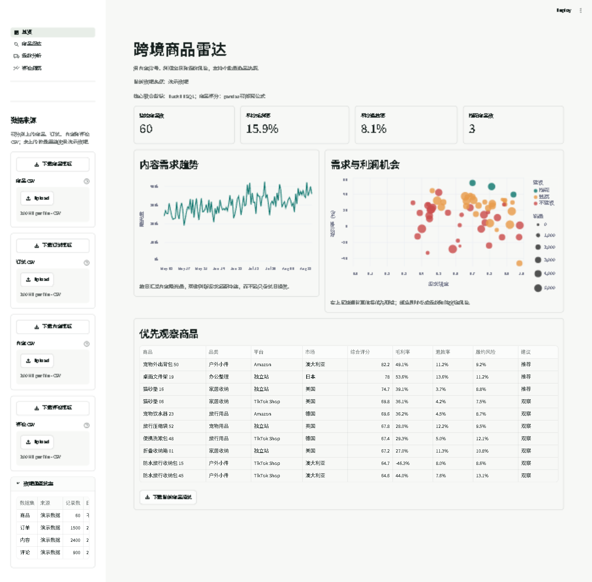
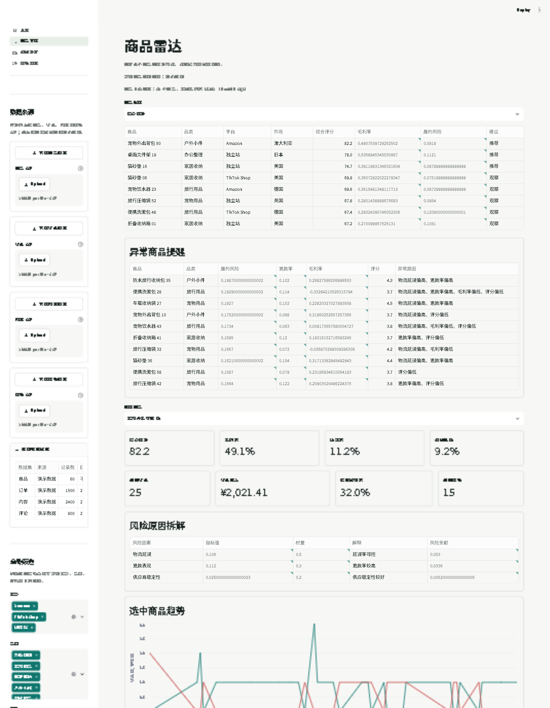
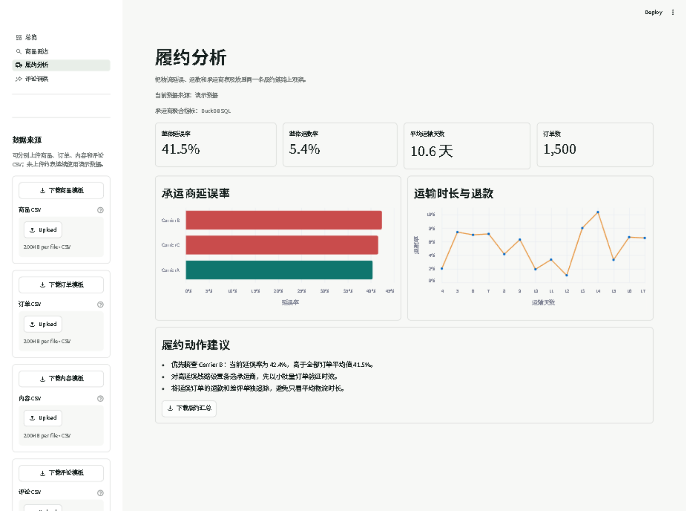
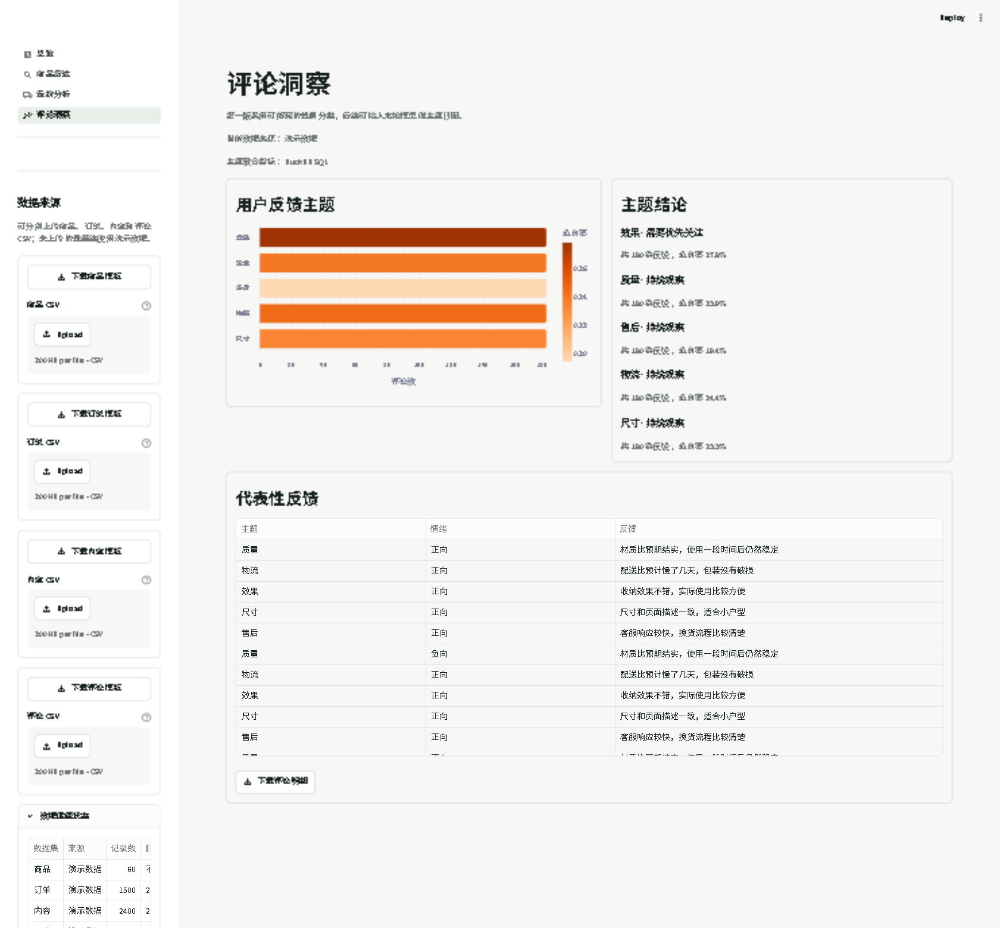

# 跨境电商选品与履约分析平台

  

一个面向跨境电商运营和物流运营岗位的可展示分析项目。它使用确定性的演示数据，完成商品评分、毛利率分析、内容信号分析和物流履约风险分析。

**▶ [在线演示](https://kayexk-crossborder-radar.streamlit.app)** — Streamlit Cloud 托管，免费容器冷启动约 1 分钟，无需账号

## 界面预览

| 总览看板 | 商品雷达 |
| --- | --- |
|  |  |
| **履约分析** | **评论洞察** |
|  |  |

## 快速运行

```powershell
cd outputs/crossborder-product-radar
python -m pip install -r requirements.txt
streamlit run streamlit_app.py
```

打开 `http://localhost:8501`。

运行自动化测试：

```powershell
python -m pytest -q
```

## 项目范围

本期包含：

- 商品、内容、订单、评论演示数据
- 商品、订单、内容、评论 CSV 模板下载、上传和字段校验
- 商品综合评分和推荐理由
- 毛利率、退款率、延误率和供应链风险分析
- DuckDB 内存查询层：用 SQL 返回 KPI、承运商和评论主题聚合
- 总览、履约和评论页支持日期范围筛选与 CSV 结果导出
- 商品雷达将评分与订单、履约、评论表现按 `product_id` 联合展示
- 商品雷达支持按评分、毛利率、履约风险和销量排序，并展示选中商品的日订单/评论趋势
- 商品雷达提供风险贡献拆解和异常商品提醒，显示延误、退款、毛利及评分触发原因
- 侧边栏显示四张表的数据来源、记录数、日期范围和商品关联率
- 全局筛选状态：平台、品类、市场和统一日期范围在四个页面之间同步
- Streamlit 多页面看板
- 纯函数指标测试和 Streamlit AppTest

本期不包含：

- 小红书、抖音或电商平台的真实账号登录和自动抓取
- 真实交易、支付和订单系统
- 自动化投放和自动下单
- 依赖外部大模型才能运行的功能

## CSV 数据导入

在左侧“数据来源”区域可以分别下载并上传四类数据模板。上传哪张表，就替换哪张表；未上传的表继续使用演示数据。订单、内容和评论中的 `product_id` 必须存在于当前商品目录。

商品 CSV 必须包含以下字段：

```text
product_id, product_name, category, platform, country,
keyword_demand, content_score, avg_price, cost_price,
commission_rate, logistics_cost, ad_cost, return_rate,
delay_rate, supplier_stability, competition_index, sales_count, rating
```

比例字段使用 `0` 到 `1` 的小数，例如 `0.08` 表示 8%；`rating` 使用 `0` 到 `5` 的评分。上传失败时页面会显示缺失字段、重复 ID、无法识别数字或超出范围的具体原因。

订单 CSV 需要 `order_id`、`product_id`、`order_date`、`country`、`carrier`、`revenue`、`ship_days`、`delayed`、`refunded`；内容 CSV 需要 `product_id`、`capture_date`、`platform`、曝光互动字段；评论 CSV 需要 `review_id`、`product_id`、`review_date`、`theme`、`sentiment`、`text`。日期会标准化为 pandas datetime，布尔值支持 `true/false`、`1/0` 和 `是/否`。

## 数据查询层

数据流为“演示数据/商品 CSV → pandas 字段校验与商品评分 → DuckDB 内存查询 → Streamlit/Altair 看板”。`utils/duckdb_store.py` 使用 `register()` 将 DataFrame 注册为临时关系，核心聚合通过 SQL 返回；商品综合评分仍保留在 pandas 中，便于面试时解释评分公式。DuckDB 使用 `:memory:` 连接，不保存上传文件，也不改变订单、内容和评论仍为演示数据的范围。

SQL 结果通过 `tests/test_duckdb_store.py` 与 `utils/metrics.py` 的 pandas 基线逐项对照，覆盖 KPI、承运商汇总、评论主题汇总和空数据输入。

## 日期筛选与导出

左侧“全局筛选”统一控制平台、品类、市场和日期范围。日期范围会分别映射到订单日、内容采集日和评论日，因此切换页面后仍保持同一分析窗口。总览页筛选 KPI、内容趋势和商品清单；履约页筛选承运商表现；评论页筛选主题和明细。各页均可下载当前筛选结果 CSV，导出的内容只包含当前全局筛选范围。

商品雷达会用 DuckDB 将订单和评论聚合到商品粒度，展示关联订单数、订单收入、实际延误率、退款率、评论数和负向率。它们用于解释商品评分后的真实业务表现，不会反向修改评分权重。

上传数据后，侧边栏的“数据健康状态”会汇总当前会话中的四张表；商品关联率低于 100% 时会给出提示，帮助在分析前发现关联问题。

## 文档

- [项目索引](00-项目索引.md)
- [需求与范围确认](01-需求与范围确认.md)
- [系统架构](02-系统架构.md)
- [任务与验收清单](04-任务与验收清单.md)
- [T-006 DuckDB 查询层](05-T-006-DuckDB查询层.md)

## 参考项目

页面信息层级参考 [OpenPanel](https://github.com/Openpanel-dev/openpanel) 和 [Frappe Insights](https://github.com/frappe/insights)。本项目的数据模型、指标计算和页面代码独立实现。
